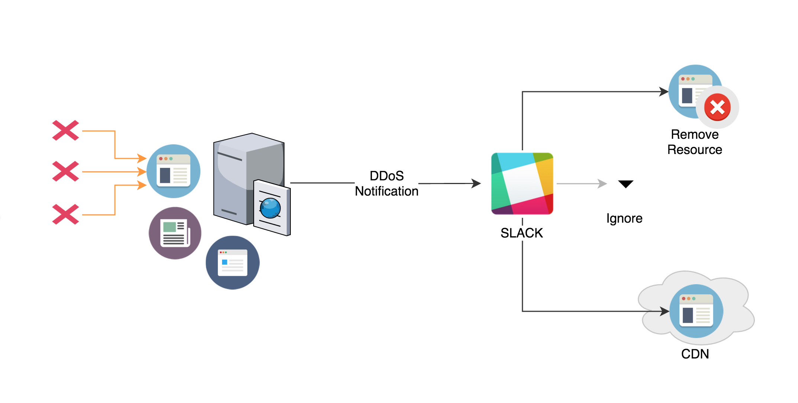
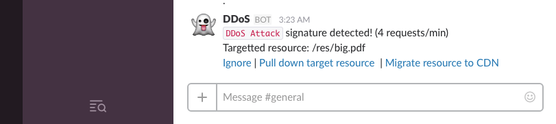

# DevOps-Project *(MileStone - 4)*

Team:

* **Anand Varma Chekuri** (ACHEKUR)
* **Shrey Sanghavi** (SSANGHA)

---

### Special Milestone - DDoS Sentry

For the implementation of our special milestone, we implemented "DDoS Sentry", a continuous monitoring framework that is capable of identifying possible DDOS attacks by analyzing at the load-balancer layer, the various HTTP requests that are being made to the application servers.

#####*DDoS Attacks and associated Pain-points:*
DDoS or Distributed Denial of Service attacks are orchestrated/timed attacks that often originate from various compromised machines all across the internet. With the advent of the Internet-of-Things and the large number of devices that are connected to the Internet, this problem only gets more worse. 

* Random nature of source of origin makes it really difficult to pin-point and thereby difficult to block individual sources to mitigate the attack.
* Attackers often target a single IO bound end-point of an application *(eg: a large pdf on a website)* in order to saturate system resources and prevent legitimate users access to the service.
* Attacks often happen at off-hours when immediate action cannot always be taken.

#### DDoS Sentry

To address the above pain-points, we implemented a continuous monitoring system that looks for attack-signature patterns in the incoming requests and when a DDoS attack is suspected, it sends a slack notification to the team. Since the attack can happen at any given time, having a notification sent to everyone just increases the odds of action being taken against it.

The slack notification shows important information about the target resource of the attack and the velocity (requests/sec). Also, the notification has buttons that let the admin/user perform rapid-actions to counteract the attack, such as:

*	**Ignore** - If the user decides that the spike in traffic is expected or if the velocity is too low, he may decide to take no action and discard the alert.
* **Pull down target resource** - If the user decides that the resource being attacked is not critical to the application, he may have it pulled down so that the attack is stopped in it's tracks. This can serve as a deterrent until   the root cause is found and patched.
* **Migrate resource to CDN** - But when the target-resource is critical to the application and we cannot afford to pull it down, the user can choose to have the resource moved to a third-party Cloud service provider (Amazon-S3) or a CDN.

### Screencast

[Milestone 4 - DDoS Sentry Demo](https://youtu.be/35gJQhzFBS8)

