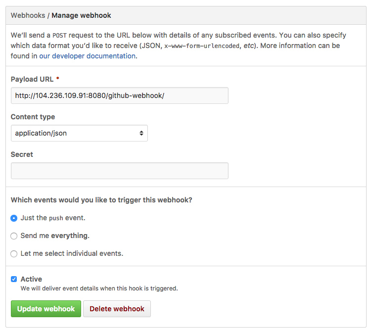
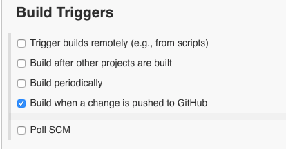
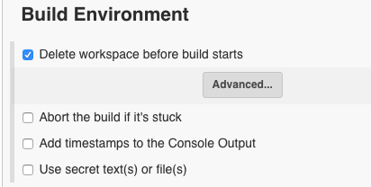
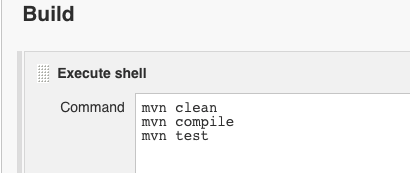
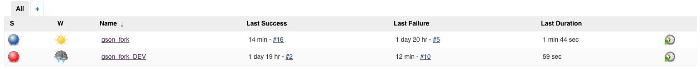

# DevOps-Project

###Team:
* Anand Varma Chekuri (ACHEKUR)
* Shrey Sanghavi (SSANGHA)

--

 

### Build
---

#### The Setup Process

*Installing Jenkins:*

	sudo yum -y install java
	sudo wget -O /etc/yum.repos.d/jenkins.repo http://pkg.jenkins-ci.org/redhat/jenkins.repo
	sudo rpm --import https://jenkins-ci.org/redhat/jenkins-ci.org.key
	sudo yum install jenkins
	sudo systemctl start jenkins.service
	
*Installing Dependencies:*
	
	sudo yum install -y git
	sudo yum install -y maven
	sudo yum install java-1.6.0-openjdk-devel
	sudo yum install mailx

For the purpose of the project-deliverable, we decided to use the Google's [**gson**](https://github.com/google/gson) *(JSON library for Java)* as the source code to build and test our CI system with. The configuration management software of choice for the project was **Maven** and therefore Jenkins was configured to demonstrate maven builds on a clone of this code-base.

#### Config

Post installation, most of the configuration is done using the web-interface for Jenkins [http://JENKINS_IP:8080](http://JENKINS_IP:8080). The resulting configuration files were backed up from "/var/lib/jenkins/" and added to the current GIT repo [here](https://github.ncsu.edu/achekur/DevOps-Project/tree/master/jenkins_config). The included configuration contains the config.xml files for Jenkins and for both the Jobs *(one for each branch)* that were setup.

--

 
#### 1. Trigger Builds on Commit

In order to trigger a build every time a commit is pushed to the GIT repo, we use Github Webhooks. The webhook is configured to send out a POST request to Jenkins' GIT plugin every time **push** event is observed by the GIT server.

Also, while configuring a project on Jenkins, we check the "Build when a change is pushed to GitHub" options. This completes the trigger configuration from the Jenkins' side and the GIT plugin handles the POST requests made by the webhook.

--

 
#### 2. Clean Builds, Build Management

To ensure that each build happens in a clean and controlled environment, we configured Jenkins to delete the workspace before a new build starts. This prevents running build jobs with stale artifacts from a previous builds.

Also, the build script is written to execute **"mvn clean"** before building. This way, we can be sure that the build environment is always new.

--

 
#### 3. Handling build success/failures
Jenkins comes pre-installed with a plugin that sends out emails to a given set of addresses when a critical event occurs *i.e.* build-fails or when an unstable project becomes stable, etc.

In order to get finer control over what actions need to taken when a build Passes or Fails, we installed and configured the [Hudson Post Build Task](http://wiki.hudson-ci.org/display/HUDSON/Post+build+task) plugin. This plugin allows us to configure custom shell scripts to run upon job completion, based on the return value (PASSED or FAILED). We used the following script to send out an email to a particular recepient every time a build passes, in-order to demonstrate post-build script functionality.

	echo "Build was successful" | mail -s "[Jenkins][GSON Fork] Build Success" ssangha@ncsu.edu

--

 
#### 4. Branch specific builds

To enable and demonstrate CI of multiple branches, we setup multiple Jenkins Projects, one for the "master" branch and one for the "development" branch. This allows us to seperate the configuration for both branches and to track the branches and their build stabilities individually. The projects were configured in such a way that "pushes" made to the development branch triggered a build only on the DEV project and likewise for the master branch, allowing us to track them in isolation.

--

 
#### 5. Build Hisory

Jenkins comes pre-loaded with the option to browse through the "Build History" for all the configured projects. This view is presented in HTML and can be accessed via a web-browser at the following link: [http://JENKINS_IP:8080/view/All/builds](http://JENKINS_IP:8080/view/All/builds)