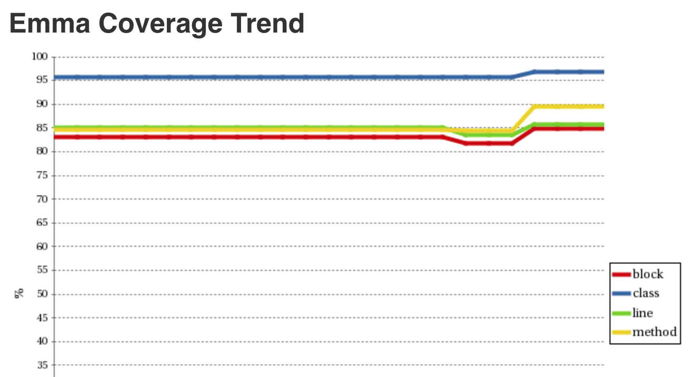
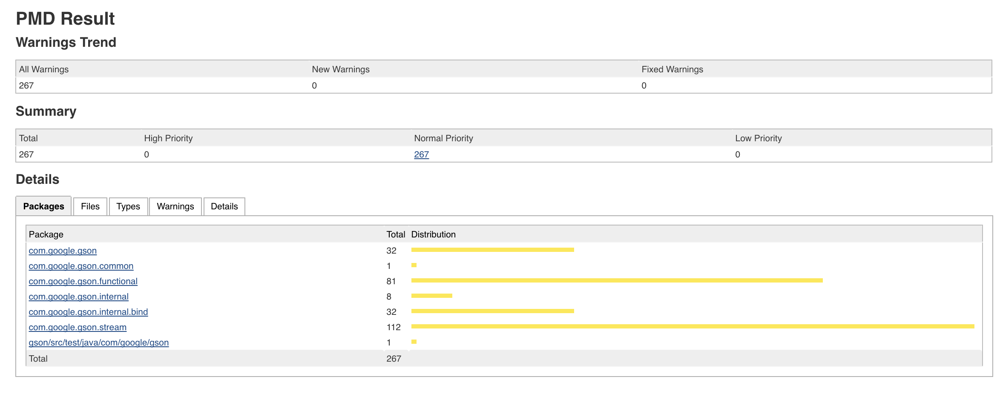
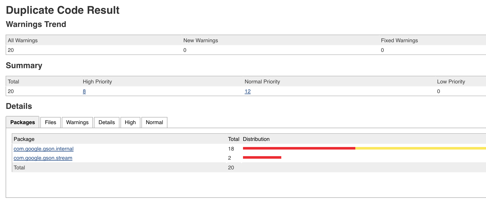

# DevOps-Project *(MileStone - 2)*

###Team & Contributions:
* **Anand Varma Chekuri (ACHEKUR)**
	* Setup Jenkins
	* Test Suites
	* Advanced Testing
	* Gates
	* Write-up
* **Shrey Sanghavi (SSANGHA)**
	* Configure Jenkins
	* Basic Analysis
	* Custom Metrics
	* Duplicate Code detection
	* Screen-cast

 
#### System under Test
For the purpose of the project-deliverable, we decided to use the Google's [**gson**](https://github.com/google/gson) (JSON library for Java) as the source code to build and test our CI system with. The configuration management software of choice for the project was **Maven** and Jenkins was configured to demonstrate maven builds on a clone of this code-base.

 
### Test
---

#### Test Suites

The GSON project comes with it's own JUnit test cases *(nearly 1000 individual tests)* and we used the **Surefire** Maven Plugin to generate XML reports of the results of these test cases. The reports generated were published using the JUnit plugin and displayed in a tabular fashion using the Test Result Analyzer plugin for Jenkins.

	mvn surefire-report:report

Emma was used to gather Test Coverage information for our Java code-base. We decided to use the [Emma Maven plugin](http://emma.sourceforge.net/maven-emma-plugin/) to run test coverage analysis on our code and generate XML reports. The reports are then displayed on Jenkins using the [Emma plugin](https://wiki.jenkins-ci.org/display/JENKINS/Emma+Plugin).

	mvn emma:emma

 
#### Advanced Testing

We have decided to demonstrate this section using the **Randoop** Test Generation tool for Java. This tool generates JUnit test cases for a given project which can be used to find Errors and to extend Regression Tests to improved coverage.

We ran the randoop tool on our "gson" project and were able to  furhter boost the already good test-coverage of this project.

	java -classpath "randoop-all-3.0.6.jar:gson.jar" randoop.main.Main gentests --classlist=myclasses.txt --timelimit=300

 
### Analysis
---

#### Basic Analysis

To demonstrate the ability to run static-analysis tools on the codebase, we decided to use PMD, which we learnt was widely used in the industry. To enable PMD analysis of our gson project, we used the Maven PMD plugin. The plugin generates XML reports for each run which were setup to be consumed by the PMD Jenkins plugin and displayed on the Jenkins web console.

We also configured our test-pipeline and Jenkins framework to run the Findbugs and CheckStyle tools along with PMD.

#### Custom Metrics

We have decided to implement some of our custom metrics reporting using the CheckStyle tool and the CheckStyle Jenkins interface that we already setup. This tool allowed us to easily write custom rules and integrate them into our pipeline:

* **Max Condition**
* **Long Method**

The rest of the custom metrics were implemented as command line scripts that were added as part of the build process:

* **Free Style** (Security Token Detection)

	We chose to implement a check that makes sure that no Authentication tokens are checked into the code. This prevents misuse of tokens commonly used to provision cloud services. 
	
	We implemented this functionality using the "grep" command by searching the code base recursively against a regular-expression pattern to find likely authentication tokens. Then we short list the filtered data to check if the same line contains any keywords such as "AWS", "AUTHENTICATION", "API_TOKEN", etc. and any match is flagged by sending exit code 1. Jenkins fails the build in response to the exit code.

		! grep -nr "[a-zA-Z0-9]\{40,64\}" . | egrep "AWS|TOKEN|AUTHEN|API_TOKEN|DigitalOcean"

* **Duplicate Code Detection**
	
	We implemented the duplicate code detection component using PMD's Copy Paste Detector or [CPD](http://pmd.sourceforge.net/pmd-4.3.0/cpd.html) module. We run CPD on our code base, configured to output an XML report of it's findings. The data is consumed using the [DRY Jenkins Plugin](https://wiki.jenkins-ci.org/display/JENKINS/DRY+Plugin) which displays the report in an easy to consume GUI.

		java -classpath pmd-4.2.5.jar net.sourceforge.pmd.cpd.CPD --minimum-tokens 100 --files gson/src/main/java/com/google/gson/ --format net.sourceforge.pmd.cpd.XMLRenderer > cpd_report.xml

#### Gates

To implement gating of builds that do not pass our static-analysis checks, we have configured our Jenkins system to fail builds that violate certain thresholds set on these checks. Through a post-build script, we capture the outcome of a given build and in case of a failure, inform the user via mail and also revert the top most commit off of the git tree.

	echo "Build GATED!"
	echo "Build Gated. Reverting your commit from GitHub." | mail -s "Build Gated" ssangha@ncsu.edu
	
	git remote set-url origin git+ssh://git@github.com/sasanghavi/gson.git
	git push -f origin HEAD^:master
	
	
 	
### Screen-cast
[**MileStone 2 Screencast**]()